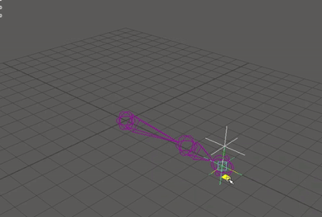
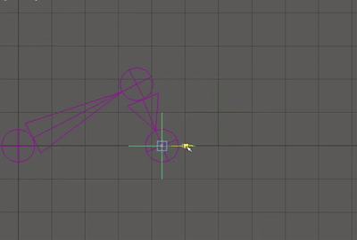
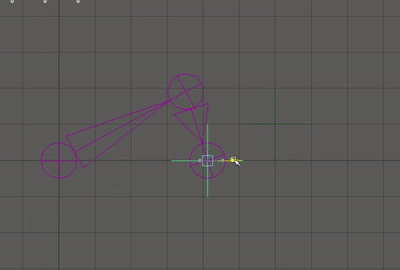
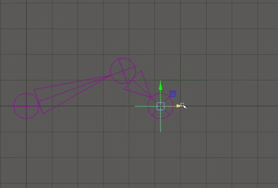
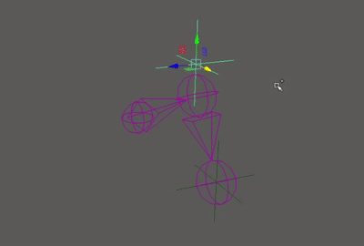

# Simple IK
This project includes two maya nodes, that perform common rigging tasks.
### Two Bone IK
Is a fast alternative to the default Maya IK. It operates on two bones, using a target locator.

  

The node allows for the bones to be stretched when the target locator distance excedes the combined bone length.

  

It also has a softening factor to fix visual popping issues that occur when fully extending the IK.

  

These two features can be combined.

  

There is also an independent twist factor to roll the bones around their imaginary base edge.

  

### Incline Angle
This is a subset of the Two Bone IK node, that only calculates the inclination of the IK, based on the target locator. 

## Build
The makefile provided builds the node for Fedora Linux.
It uses C++11.
The Maya installation directory should be specified through the `MAYA_LOCATION` env var.
The Maya plug-in path should be specified through the `MAYA_PLUGIN_PATH` env var.
Optionally you may set a prefix for the two nodes through the `NODE_NAME_PREFIX` env var, this defaults to `sik_` (simple ik).
